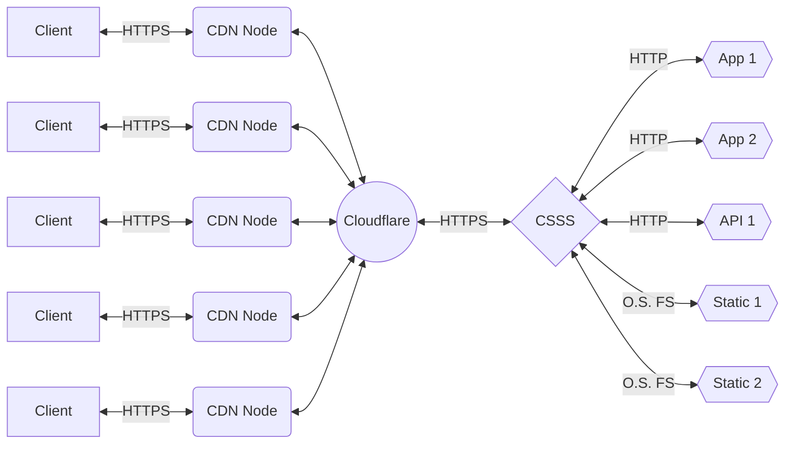

# "CloudFlare-SSL-Subdomain-Service"?! What is this?

This is a script that based on a JSON file automates to offer a proxy server to several web pages, services or applications (as you could do with an Apache or Nginx server but simpler), connects to the Cloudflare CDN and manages the use of SSL certificates, updates the records for the domains/subdomains in Cloudflare belonging to the applications managed by the server and based on them redirects the requests.

A simple solution that allows you to have a server of multiple web services online and with https taking advantage of the free tier of the cloudflare CDN following this scheme. If you access the website christianvillegas.com, or any of its subdomains, you are already making use of this project.

