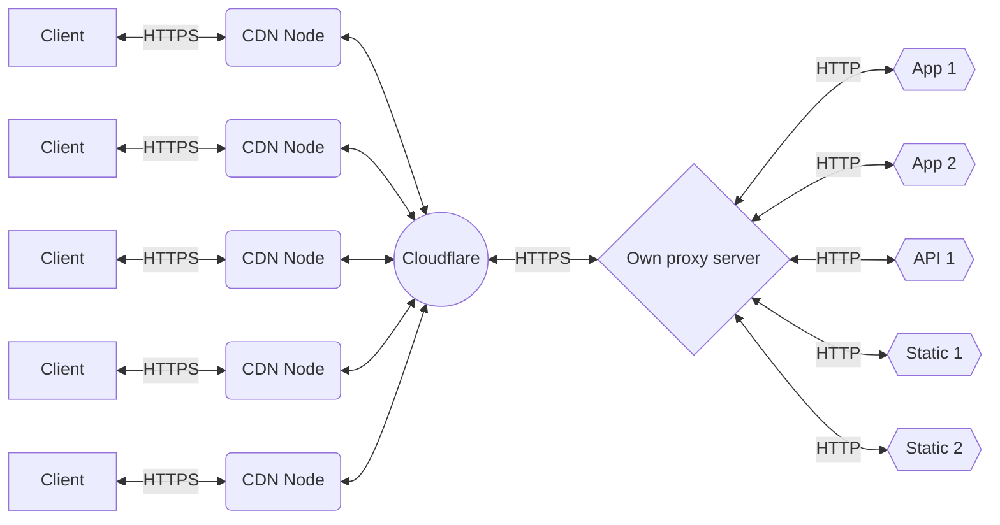

# "CloudFlare-SSL-Subdomain-Service"?! What is this?

This is the (on my lack of imagination to give it a good name) the "**CloudFlare-SSL-Subdomain-Service**" or **CSSS** now to be short on the rest of the text. Was born as a solution of the necesity to have my own flexible server, inspirated form the proyects done by [Jeff Geerling](https://www.jeffgeerling.com/) ( you can see it on his [Youtube channel](https://www.youtube.com/channel/UCR-DXc1voovS8nhAvccRZhg) ), not only to pass through the experience of deploy my own services or apps on a more closer, low energy consumption, low-budget server whit more tools but also stay free of the limitations of the "free" ways to deploy apps, APIs, etc. on the web.

## Is it a free way to have your own server?
It cost a DNS domain that cost around 9 U$D peer year, an old low-power PC or, like Jeff G. do, a raspberry (or a bunch if you are Jeff) that came "ON" on its own in the event of a cut electric power, (on PCs the option should be in de BIOS), an Internet connection with the possibility of do a port forwarding of de HTTPS standard port (443) or disable the NAT (Network Address Translation protocol) to have your own router to do the port forwarding, and the electric power to power it.

*(To be focused on this project I'm not going deeper about how configure your BIOS or do a Port Forwarding or anything else because Google is full of videos or documentation to learn how to do it and is a world of variants on every case, but i have the confidence to tell you that if you understand this project, you could find and understand the rest)*

No, it's not free! but may be a low-cost way, if want to learn deeper about what is behind a deploy of a web, app, a server, etc. with the possibility of literally broke everything but learn about it and have a more powerful and extensive playground to have working your, landing page, portfolio projects, or may be your apps 's demos for your future or current clients.

## What we want to resolve?

### The inner side
A server should be capable of give multiple services like pages, apps or APIs, but if, for example, you runed a http server, you know that you could run one app on one port. In the case that you want to have other apps you don't have other option than use more ports giving URLs like http://chrisitanvillegas.com:10000, :10001, :10002, etc. Totally ugly and out of any standard, or taking a risk putting everything on one app, a "multiapp", stealing any app independency in case of a failure of one, not being agnostic of the execution environment and giving URLs like http://chrisitanvillegas.com/app1, /app2, etc. (ugly to, if you ask me).
So, the solution that I found is use subdomains giving URLs Like app1.christianvillegas.com, app2.christianvillegas.com, etc. without putting everything in the same instance of the execution environment, An HTTP request listener capable of conmute with other HTTP servers and answer for them. this concept isn't new, is a HTTP proxy and is easily achievable using some libraries of node. This I used in this project:

 - [Express.js](https://expressjs.com/): for the HTTP Listener.
 - [Express vhost middleware](https://expressjs.com/en/resources/middleware/vhost.html): to recognize the subdomain of the request and derivate it to the correct middleware.
 - [express.static()](https://expressjs.com/es/starter/static-files.html): is not a library, is a middleware part of Express JS but I'm putting it here because is importan the use of it in case of no really need a proxy when you only have to answered whit static files.
 - [Villadora's express-http-proxy](https://github.com/villadora/express-http-proxy): An Express middleware to proxy request to another host and pass response back to original caller. 
 
### The Outside
All of the above is perfect, or at least a good solution, but I was concerned about the security of my home network. Expose my public IP isn't a good idea or at least nothing to not worry about, Luckly exists a good and easy achievable solution for this. Let me introduce you to the Cloudflare CDN (No! is not sponsoring me in any way). Cloudflare have free tier of their "content delivery network" (CDN for short) that makes an inverse proxy from your sever to their distributed servers over the world, creating an encrypted tunnel in middle and exposing the IP of the Cloudflare's servers and not your IP. 
My concerns were resolved but, if that were not enough, using the Cloudflare's CDN gives you an easy way to get SSL certificates for your server, a protection for hacker attacks like DDoS and local cache on the CDN nodes of the HTML, CSS and JavaScript content (on the free tier of the service) to give the shorter times of response that the CDN could in any part of the world.

#### The result is this ...

*(Working on the readme, sorry 🙇🏻‍♂️ 
it will be complete soon 😊)*
